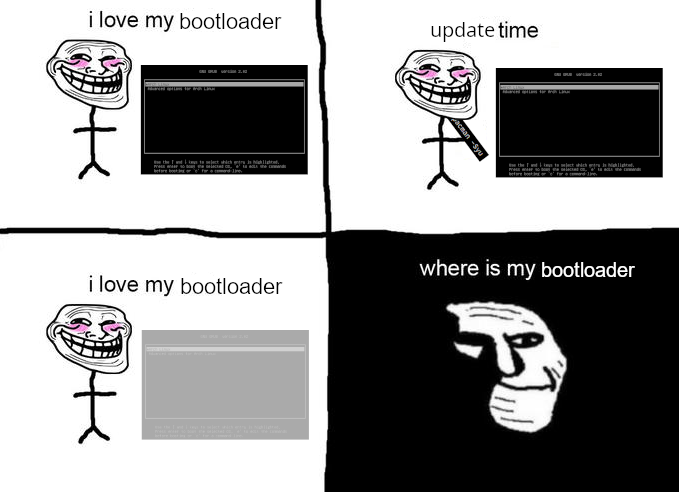

Rozdział 5: Podsumowanie
========================

Piractwo komputerowe pozostaje jednym z największych wyzwań
współczesnego świata cyfrowego. Pomimo licznych działań prawnych i
technologicznych, zjawisko to wciąż występuje na dużą skalę. Kluczem do
ograniczenia jego wpływu jest połączenie skutecznych rozwiązań
technicznych z edukacją społeczną, promowaniem świadomości prawnej oraz
rozwijaniem atrakcyjnych, legalnych źródeł treści. Tylko dzięki
wspólnemu wysiłkowi użytkowników, firm i instytucji państwowych możliwe
będzie zbudowanie zdrowego ekosystemu cyfrowego opartego na zasadach
uczciwości i poszanowania pracy twórców.

Nowoczesne metody przeciwdziałania piractwu
-------------------------------------------

+----------------------+-----------------------+-----------------------+
| Metoda               | Opis                  | Zastosowanie          |
+======================+=======================+=======================+
| Sztuczna             | Automatyczne          | Monitoring treści     |
| inteligencja         | wykrywanie            | multimedialnych       |
|                      | nielegalnych treści w |                       |
|                      | sieci.                |                       |
+----------------------+-----------------------+-----------------------+
| Blockchain           | Technologia           | Dystrybucja muzyki i  |
|                      | pozwalająca na        | oprogramowania        |
|                      | śledzenie             |                       |
|                      | oryginalnych kopii    |                       |
|                      | plików.               |                       |
+----------------------+-----------------------+-----------------------+
| Watermarking         | Dodawanie cyfrowych   | Filmy i zdjęcia       |
|                      | znaków wodnych do     |                       |
|                      | plików.               |                       |
+----------------------+-----------------------+-----------------------+
| Analiza Big Data     | Wykrywanie wzorców w  | Serwisy P2P           |
|                      | rozprzestrzenianiu    |                       |
|                      | się pirackich plików. |                       |
+----------------------+-----------------------+-----------------------+

